# 计组

# CPP

# 数学

## 外积
$A = (x_1, y_1, z_1), B = (x_2, y_2, z_2)$
$A \times B = (y_1 z_2 - z_1 y_2, z_1 x_2 - x_1 z_2, x_1 y_2 - y_1 x_2)$

## 克拉莫法则
$A x = b$
$A = (a_1, a_2, a_3), A_1 = (b, a_2, a_3), ...$
$x_i = \frac{det(A_i)}{det(A)}$

## 四元数
$q_1 = (w_1, \vec{v_1}), q_2 = (w_2, \vec{v_2}), p = q_1 q_2$
$p.w = w_1 w_2 - \vec{v_1} \cdot \vec{v_2}$
$p.v = w_1 \vec{v_2} + w_2 \vec{v_1} + \vec{v_1} \times \vec{v_2}$
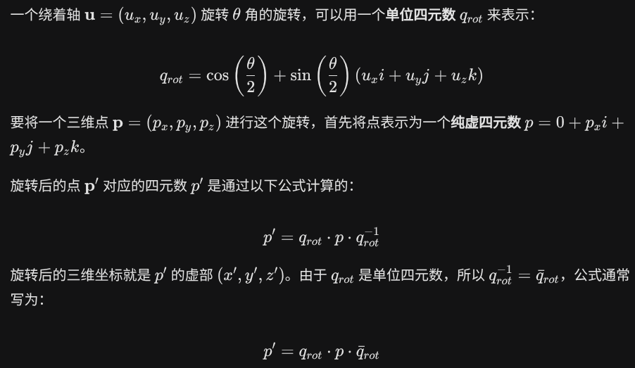

## 牛顿法
$F(x + \Delta x) \approx F(x) + \frac{\partial F}{\partial x} \Delta x = 0$
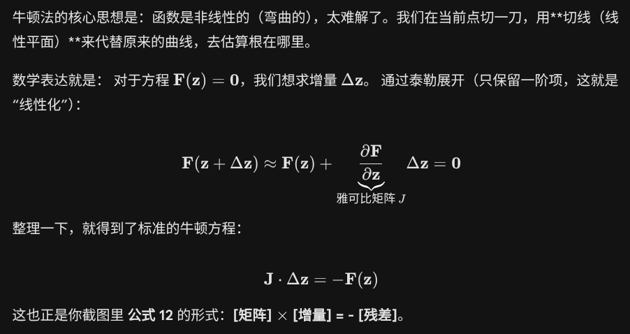

## marching cubes
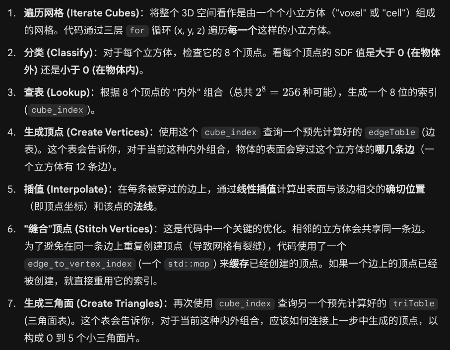

# simulate
$\frac{Dv}{Dt} = \frac{\partial v}{\partial t} + v \cdot \nabla v = -\frac{1}{\rho} \nabla p + f$
$\nabla \cdot v = 0$

$\nabla \cdot v^{n + 1} = \nabla \cdot (v^n + a \Delta t) = \nabla \cdot (v^n - \frac{\Delta t}{\rho} \nabla p) = 0$

## PBD
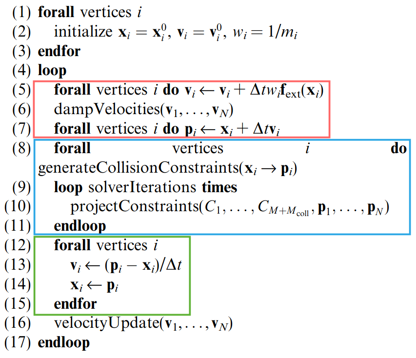
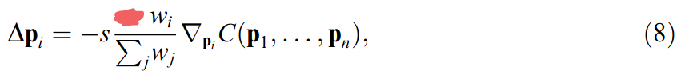
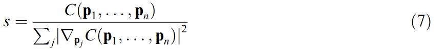
$C(p_1, p_2) = \sqrt{(x_1 - x_2)^2 + (y_1 - y_2)^2 + (z_1 - z_2)^2} - d = |p_1 - p_2| - d$
$\nabla_{p_1} C = (\frac{\partial C}{\partial x_1}, \frac{\partial C}{\partial y_1}, \frac{\partial C}{\partial z_1})$
$\frac{\partial C}{\partial x_1} = \frac{x_1 - x_2}{|p_1 - p_2|}$
$\nabla_{p_1} C = \frac{1}{|p_1 - p_2|}(x_1 - x_2, y_1 - y_2, z_1 - z_2) = \frac{p_1 - p_2}{|p_1 - p_2|}$
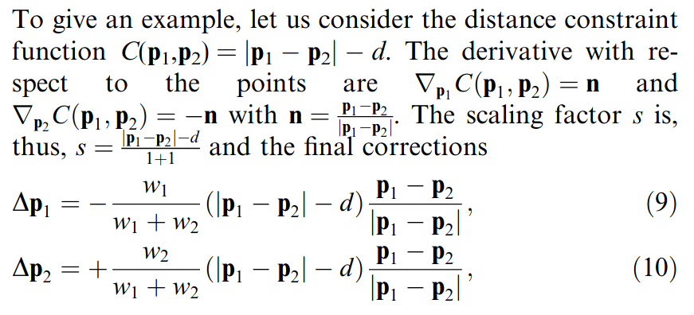
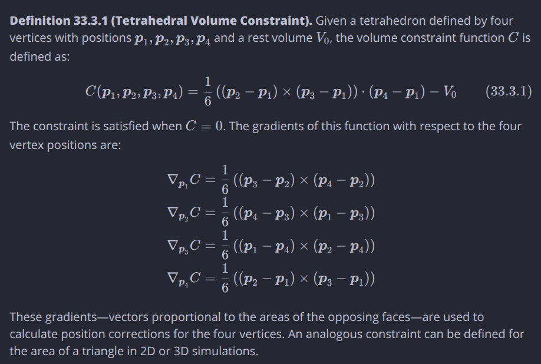

## XPBD
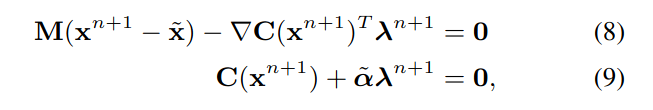
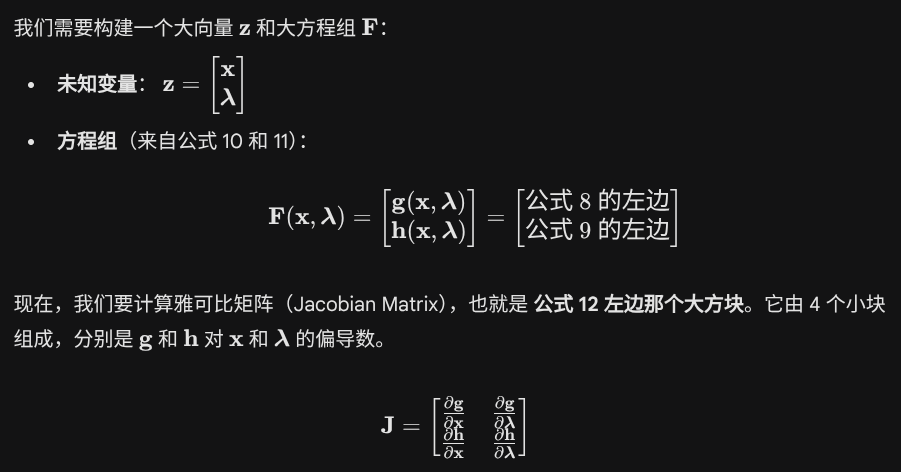
一阶泰勒展开

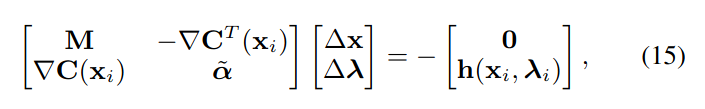
第一行结果
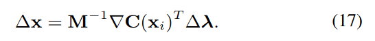
代入第二行
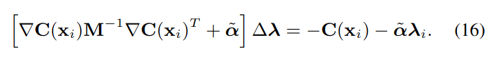
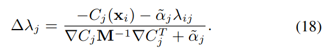

## VBD
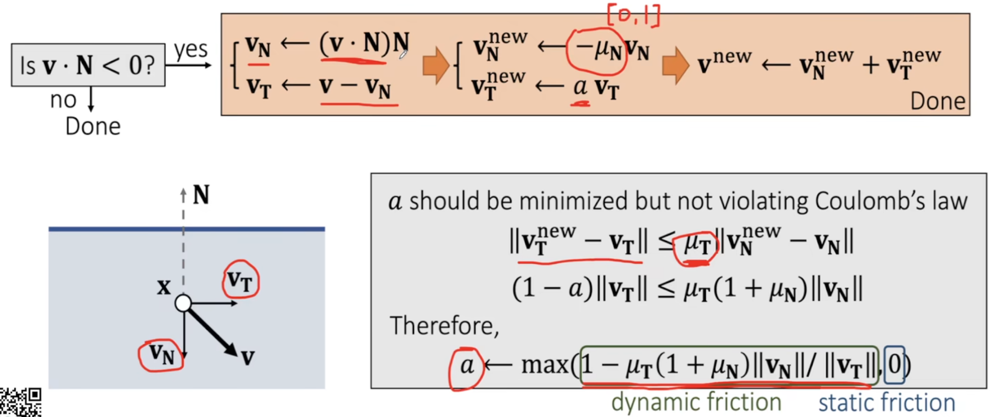

## FLIP
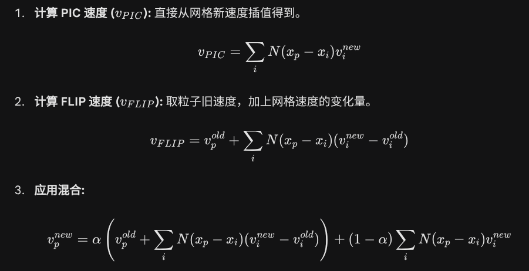

## DC-APIC

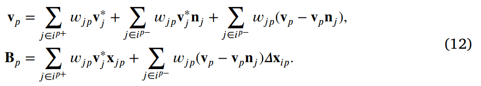

## BVH CCD
### 建树
```CPP
BVHNode* BuildBVH(std::vector<Object*>& objectPointers, int start, int end) {
    BVHNode* node = new BVHNode();
    int n = end - start;

    if (n == 1) { // 叶节点
        node->objects.push_back(objectPointers[start]);
        node->bounds = objectPointers[start]->bounds; // 包围盒
        return node;
    }

    AABB totalBounds;
    for (int i = start; i < end; i++) { // 获得其管理节点总的包围盒
        totalBounds.expand(objectPointers[i]->bounds)
    }
    node->bounds = totalBounds;

    int axis = totalBounds.longestAxis(); // 最长轴

    std::sort(objectPointers.begin() + start, objectPointers.begin() + end, [axis](Object* a, Object* b) {
        return a->bounds.centroid()[axis] < b->bounds.centroid()[axis];
    }); // 按最长轴排序

    int mid = start + n / 2;

    node->left = BuildBVH(objectPointers, start, mid);
    node->right = BuildBVH(objectPointers, mid, end);

    return node;
}
```